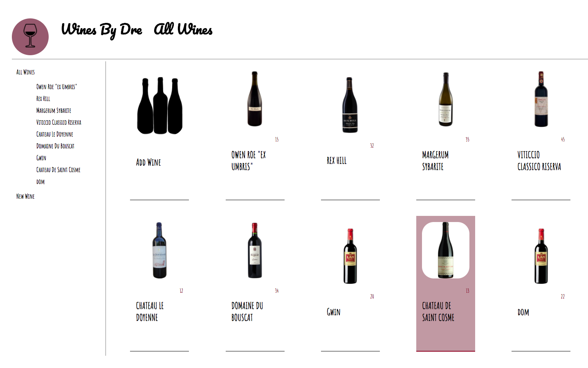
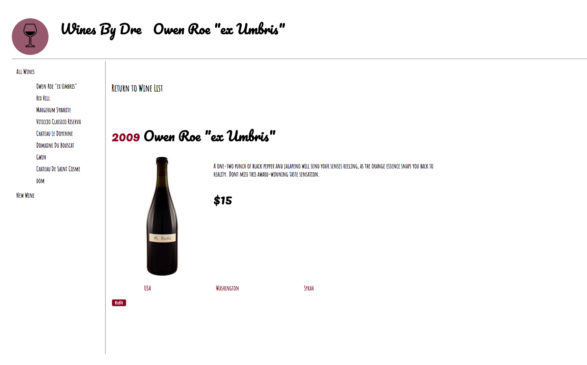

# Wine By Dre
## An App running on React

Wine By Dre is a React application running [a free heroku wine api](http://myapi-profstream.herokuapp.com/api/[app_id]/wines). It's designed in a modern, yet rustic style to give the impression of an old time store. 

### Index of All Wines

### Single Wine View

The icon is a single image containing 9 icons, with `CSS3 @keyframes` animations, `background position` set to multiple different percentages over the course of the animation. 

`App.jsx`runs the majority of the state for this app, with all state-setting methods defined in app and passed down as props. `ContentContainer`,`SingleContainer`, and `ConditionalHeading` were all containers whose purpose was to conditionally render certain elements based upon the state of `App.jsx` passed down through props. 

**Wine By Dre** also allows for creation and addition of wines with `fetch` requests to the external api, however the response is delayed. 

**Wine By Dre** will soon be hosting local storage in the functionality of a mock cart for wine purchases.
